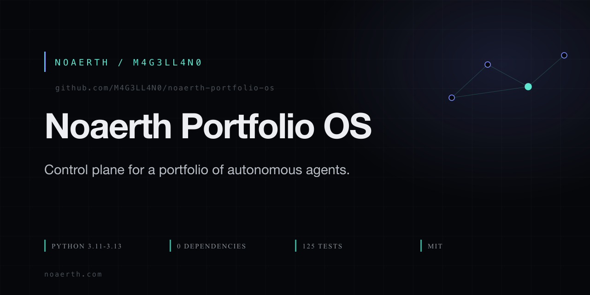

# Noaerth Portfolio OS

<p align="center">
  
</p>

**A control plane for a portfolio of autonomous agents — where the database, not the prompt, decides what happens next.**

[](https://github.com/M4G3LL4N0/noaerth-portfolio-os/actions/workflows/ci.yml)
[](https://www.python.org/)
[](./LICENSE)
[](https://docs.python.org/3/library/sqlite3.html)

Part of **[Noaerth](https://www.noaerth.com)** · by [M4G3LL4N0](https://github.com/M4G3LL4N0)

---

## 30-second version

Most agent systems keep their state in a prompt, a JSON file, or a model that
remembers what it did last time. That works right up until two agents touch the
same thing.

Portfolio OS is a **SQLite-backed work queue with reviewer separation and an
allowlist-based public boundary.** Agents propose. A different role reviews. A
human releases. Nothing crosses from internal to public without passing an
explicit allowlist rather than a cleanup pass.

It is stdlib-only. No pip install. Clone it and run it.

---

## Quickstart

```sh
git clone https://github.com/M4G3LL4N0/noaerth-portfolio-os.git
cd noaerth-portfolio-os

# Point it at a directory of projects. Nothing is written until you say so.
# --root and --db are global, so they go before the subcommand.
PYTHONPATH=. python3 -m portfolio_os --root ~/startups discover

# What does the control plane actually think the state is?
PYTHONPATH=. python3 -m portfolio_os status
PYTHONPATH=. python3 -m portfolio_os startups

# Check the install is sound.
PYTHONPATH=. python3 -m portfolio_os doctor
```

Run the tests:

```sh
PYTHONPATH=. python3 -m pytest -q      # or: python3 -m unittest discover -s tests
```

Start the local engine UI:

```sh
PYTHONPATH=. PORTFOLIO_OS_API_TOKEN=... python3 -m portfolio_os up
# serves http://127.0.0.1:8787, loopback only
```

---

## What it actually does

| Capability | Command | The rule it enforces |
| --- | --- | --- |
| **Discovery** | `discover` | `openlegal-data` is refused at directory discovery. Only `OWNER-PRIVATE` is stored — no path, no contents. |
| **Queue** | `queue`, `startup <slug>` | Every agent run holds a lock. Two agents cannot claim the same work item. |
| **Review separation** | `review --role <R> --dimension <D>` | **The role that implements a change cannot close that change by reviewing it.** A failed review creates follow-up work. |
| **Visual QA** | `run --startup <slug>` | A page returning HTTP 200 is not a pass. `VISUAL_QA_PENDING` stays until a reviewer records desktop *and* mobile passes. |
| **Release blocking** | `block-release`, `approve-release` | Deployment stays suppressed while a Vercel daily-cap blocker is on record. Design and review work still runs. |
| **Isolated work** | worktrees | Dirty product repos are never edited in place. Work goes to `portfolio/<startup>/<work-item>`. |
| **Public boundary** | `publish` | `public.json` is built from an **allowlist**. `PRIVATE_SYSTEM` events are excluded by construction, not by scrubbing afterwards. |
| **External intelligence** | `landscape` | Scores reuse fit and reuse leverage, then recommends `OWNER_REVIEW`. Nothing self-authorises. |

---

## Architecture

```text
                        discover / import ledgers
                                  │
                                  ▼
                    ┌──────────────────────────┐
                    │      SQLite              │  source of truth
                    │  work · reviews · locks  │
                    │  events · agent_runs     │
                    └────────────┬─────────────┘
                                 │
        ┌────────────────────────┼────────────────────────┐
        │                        │                        │
        ▼                        ▼                        ▼
  work queue             review queue            allowlist filter
  locks                  role separation         PUBLIC events only
        │                        │                        │
        │                        ▼                        ▼
        │                 follow-up work           publish/public.json
        │                 (implementer cannot                │
        │                  close its own change)            ▼
        │                                          noaerth.com  /labs
        └──────────────────────────────────────────────────┘
```

Three invariants hold the design together:

1. **State lives in the database.** A model that forgets is a recoverable
   incident, not a data loss.
2. **Review is a different role from implementation.** Separation is enforced
   by the schema, not by asking nicely.
3. **Public is an allowlist, not a filter.** Anything not explicitly marked
   public stays internal. The failure mode is *too private*, never *too public*.

---

## Verified

Everything below was produced by running the code, not by describing it.

| Check | Result |
| --- | --- |
| `python3 -m pytest -q` | **125 passed** |
| `python3 -m portfolio_os --help` | exit 0 |
| `python3 -m portfolio_os doctor` | exit 0 |
| Runtime dependencies | **none** — `sqlite3`, `argparse`, stdlib only |
| CI matrix | Python 3.11, 3.12, 3.13 |
| Secret scan (gitleaks, tree + full history) | **0 findings** |

`publish/public.json` is checked in on purpose. It is the real sanitised output
of `portfolio publish` — slug, name, public status, URL, GitHub link, nothing
else — so you can see the boundary rather than take it on trust.

---

## Project status

Active. This is the control plane that runs the Noaerth portfolio, and it is
used in production rather than demonstrated at a conference.

Deliberately **not** built:

- Multi-tenant auth. Single operator, loopback, hashed secret compared in
  constant time.
- A cloud service. It is a control plane, not a SaaS product.
- Its own agent runtime. That is [AgentOS](https://github.com/M4G3LL4N0/agentos).

---

## Configuration

| Variable / flag | Purpose |
| --- | --- |
| `--root DIR` | Project tree to discover and operate on. Global flag; goes before the subcommand. |
| `--db PATH` | SQLite database path. Defaults to `<root>/data/portfolio.db`. |
| `NOAERTH_TEAM_SECRET` | 16+ characters, server only. Compared as a hash; sets an HTTP-only cookie. If absent, `/team` shows no internal data. |
| `PORTFOLIO_OS_API_TOKEN` | 16+ characters. Overrides the local credential for a non-loopback host. On loopback a random credential is generated and stored locally instead — it is never printed and is not valid off the machine. |
| `PORTFOLIO_OS_SHOT` | Screenshot helper used by the visual QA gate. When absent, the gate reports "no capture tool" rather than passing. |

Never commit these. They belong in the server environment.

To be explicit about what is **not** here: `PORTFOLIO_OS_PUBLIC_URL`,
`PORTFOLIO_OS_TEAM_FILE` and `PORTFOLIO_OS_WRITE_URL` appear in older
architecture notes but are not read by this code. If you need them, that is an
open gap rather than a configuration knob.

---

## Documentation

- [QUICKSTART.md](./QUICKSTART.md) — local engine UI and Team
- [docs/EXTERNAL_INTELLIGENCE.md](./docs/EXTERNAL_INTELLIGENCE.md) — the landscape lane
- [ECOSYSTEM.md](./ECOSYSTEM.md) — how the portfolio is grouped
- `portfolio --help` — every command, with arguments
- [AGENTS.md](./AGENTS.md) — instructions for agent-driven contributions

## Contributing

Branch, keep the change reviewable, prove it with a test, open a pull request.
The cheapest check that covers your blast radius:

```sh
PYTHONPATH=. python3 -m pytest -q
```

See [CONTRIBUTING.md](./CONTRIBUTING.md) if it is missing and you want to add it.

## Security

Report privately through GitHub Security Advisories rather than opening an
issue. See [SECURITY.md](./SECURITY.md).

## License

[MIT](./LICENSE) © 2026 Noaerth

Part of [Noaerth](https://www.noaerth.com) by [M4G3LL4N0](https://github.com/M4G3LL4N0).
