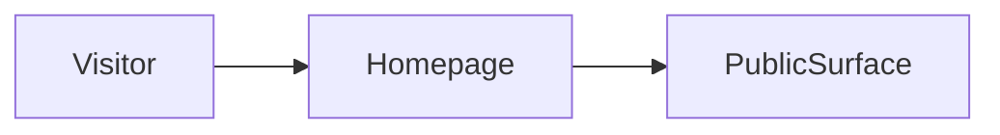

# Build map: access-layer

Derived from the repository. Not a guessed architecture.

## Canonical entrypoint
`app/page.tsx`

Next prefers ./app over ./src/app.

## Dead or superseded paths
- `src/app/account/page.tsx`
- `src/app/admin/access-points/[venueId]/page.tsx`
- `src/app/admin/access-points/page.tsx`
- `src/app/admin/leads/page.tsx`
- `src/app/admin/metrics/page.tsx`
- `src/app/admin/ops/page.tsx`
- `src/app/admin/page.tsx`
- `src/app/admin/pilot-pack/page.tsx`
- `src/app/admin/seed/page.tsx`
- `src/app/admin/venues/[venueId]/page.tsx`
- `src/app/admin/venues/page.tsx`
- `src/app/analytics/page.tsx`

These are not deleted. They are marked so the next pass does not treat them as the product.

## Homepage evidence
`app/page.tsx`

## Routes
- `app/customers/page.tsx`
- `app/docs/page.tsx`
- `app/how-it-works/page.tsx`
- `app/page.tsx`
- `app/privacy/page.tsx`
- `app/support/page.tsx`
- `app/terms/page.tsx`
- `app/trust/page.tsx`
- `src/app/account/page.tsx`
- `src/app/admin/access-points/[venueId]/page.tsx`
- `src/app/admin/access-points/page.tsx`
- `src/app/admin/leads/page.tsx`
- `src/app/admin/metrics/page.tsx`
- `src/app/admin/ops/page.tsx`
- `src/app/admin/page.tsx`
- `src/app/admin/pilot-pack/page.tsx`
- `src/app/admin/seed/page.tsx`
- `src/app/admin/venues/[venueId]/page.tsx`
- `src/app/admin/venues/page.tsx`
- `src/app/analytics/page.tsx`
- `src/app/api-docs/page.tsx`
- `src/app/auth/callback/page.tsx`
- `src/app/case-studies/sf-pilot/page.tsx`
- `src/app/checkout/page.tsx`
- `src/app/claim/[venueId]/page.tsx`
- `src/app/contact/page.tsx`
- `src/app/crm/leads/page.tsx`
- `src/app/crm/targets/page.tsx`
- `src/app/crm/templates/page.tsx`
- `src/app/dashboard/page.tsx`
- `src/app/demo/page.tsx`
- `src/app/developers/page.tsx`
- `src/app/enterprise/page.tsx`
- `src/app/government/page.tsx`
- `src/app/hardware/page.tsx`
- `src/app/health/page.tsx`
- `src/app/home-v1/page.tsx`
- `src/app/home-v2/page.tsx`
- `src/app/investors/2t/page.tsx`
- `src/app/investors/interactive/page.tsx`

## Commands
- `dev`: `next dev`
- `build`: `next build`
- `start`: `next start`
- `lint`: `eslint`

## Direct dependencies
next, react, react-dom

