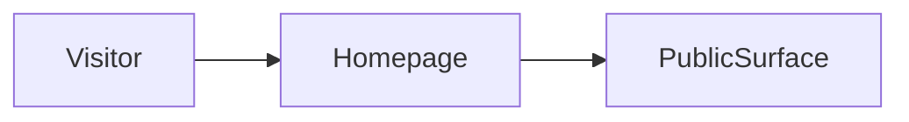

# Build map: access-layer

Derived from the repository. Not a guessed architecture.

## Homepage
`app/page.tsx`

## Routes
- `app/about/page.tsx`
- `app/blog/page.tsx`
- `app/careers/page.tsx`
- `app/compliance/page.tsx`
- `app/customers/page.tsx`
- `app/directory/page.tsx`
- `app/docs/page.tsx`
- `app/features/page.tsx`
- `app/how-it-works/page.tsx`
- `app/intake/page.tsx`
- `app/investor/page.tsx`
- `app/metrics/page.tsx`
- `app/page.tsx`
- `app/pilot-pack/page.tsx`
- `app/privacy/page.tsx`
- `app/product/page.tsx`
- `app/roadmap/page.tsx`
- `app/security/page.tsx`
- `app/support/page.tsx`
- `app/terms/page.tsx`
- `app/trust/page.tsx`
- `app/use-cases/page.tsx`
- `app/verifier/page.tsx`
- `src/app/account/page.tsx`
- `src/app/admin/access-points/[venueId]/page.tsx`
- `src/app/admin/access-points/page.tsx`
- `src/app/admin/leads/page.tsx`
- `src/app/admin/metrics/page.tsx`
- `src/app/admin/ops/page.tsx`
- `src/app/admin/page.tsx`
- `src/app/admin/pilot-pack/page.tsx`
- `src/app/admin/seed/page.tsx`
- `src/app/admin/venues/[venueId]/page.tsx`
- `src/app/admin/venues/page.tsx`
- `src/app/analytics/page.tsx`
- `src/app/api-docs/page.tsx`
- `src/app/auth/callback/page.tsx`
- `src/app/case-studies/sf-pilot/page.tsx`
- `src/app/checkout/page.tsx`
- `src/app/claim/[venueId]/page.tsx`

## Commands
- `dev`: `next dev`
- `build`: `next build`
- `start`: `next start`
- `lint`: `eslint`

## Direct dependencies
next, react, react-dom

