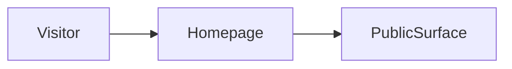

# Build map: behindcurtain

Derived from the repository. Not a guessed architecture.

## Canonical entrypoint
`app/page.tsx`

Next prefers ./app over ./src/app.

app/page.tsx re-exports src/app/page.tsx

## Dead or superseded paths
- none detected

These are not deleted. They are marked so the next pass does not treat them as the product.

## Homepage evidence
`src/app/page.tsx`

## Routes
- `app/admin/page.tsx`
- `app/docs/page.tsx`
- `app/explorer/page.tsx`
- `app/how-it-works/page.tsx`
- `app/page.tsx`
- `app/privacy/page.tsx`
- `app/profiles/[slug]/page.tsx`
- `app/support/page.tsx`
- `app/terms/page.tsx`
- `app/trust/page.tsx`
- `src/app/admin/page.tsx`
- `src/app/explorer/page.tsx`
- `src/app/page.tsx`
- `src/app/profiles/[slug]/page.tsx`

## Commands
- `dev`: `next dev`
- `build`: `next build`
- `start`: `next start`
- `lint`: `eslint`
- `typecheck`: `tsc --noEmit`

## Direct dependencies
@supabase/supabase-js, clsx, lucide-react, next, react, react-dom

