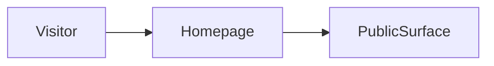

# Build map: behindcurtain

Derived from the repository. Not a guessed architecture.

## Homepage
`src/app/page.tsx`

## Routes
- `app/about/page.tsx`
- `app/admin/page.tsx`
- `app/contact/page.tsx`
- `app/dashboard/page.tsx`
- `app/demo/page.tsx`
- `app/docs/page.tsx`
- `app/explorer/page.tsx`
- `app/how-it-works/page.tsx`
- `app/intake/page.tsx`
- `app/investor/page.tsx`
- `app/page.tsx`
- `app/pricing/page.tsx`
- `app/privacy/page.tsx`
- `app/product/page.tsx`
- `app/profiles/[slug]/page.tsx`
- `app/profiles/page.tsx`
- `app/support/page.tsx`
- `app/terms/page.tsx`
- `app/trust/page.tsx`
- `src/app/admin/page.tsx`
- `src/app/explorer/page.tsx`
- `src/app/page.tsx`
- `src/app/profiles/[slug]/page.tsx`

## Commands
- `dev`: `next dev`
- `build`: `next build`
- `start`: `next start`
- `lint`: `eslint`
- `typecheck`: `tsc --noEmit`

## Direct dependencies
@supabase/supabase-js, clsx, lucide-react, next, react, react-dom

