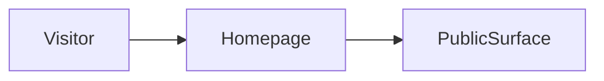

# Build map: noaerth-labs

Derived from the repository. Not a guessed architecture.

## Canonical entrypoint
`app/page.tsx`

Next prefers ./app over ./src/app.

## Dead or superseded paths
- none detected

These are not deleted. They are marked so the next pass does not treat them as the product.

## Homepage evidence
`app/page.tsx`

## Routes
- `app/activity/page.tsx`
- `app/page.tsx`
- `app/projects/[slug]/page.tsx`
- `app/week/page.tsx`

## Commands
- `dev`: `next dev`
- `build`: `next build`
- `start`: `next start`

## Direct dependencies
next, react, react-dom, react-server-dom-webpack, styled-jsx

