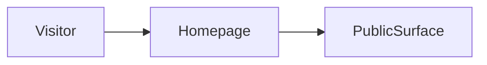

# Build map: noaerth-team

Derived from the repository. Not a guessed architecture.

## Canonical entrypoint
`app/page.tsx`

Next prefers ./app over ./src/app.

## Dead or superseded paths
- `src/app/page.tsx`

These are not deleted. They are marked so the next pass does not treat them as the product.

## Homepage evidence
`src/app/page.tsx`

## Routes
- `app/agents/page.tsx`
- `app/design/page.tsx`
- `app/engineering/page.tsx`
- `app/feedback/page.tsx`
- `app/page.tsx`
- `app/queue/page.tsx`
- `app/releases/page.tsx`
- `app/reports/page.tsx`
- `app/sites/page.tsx`
- `app/startups/[slug]/page.tsx`
- `app/startups/page.tsx`
- `app/system/page.tsx`
- `app/ventures/[slug]/page.tsx`
- `app/ventures/page.tsx`
- `src/app/page.tsx`

## Commands
- `dev`: `next dev`
- `build`: `next build`
- `start`: `next start`

## Direct dependencies
next, playwright, react, react-dom, recharts

