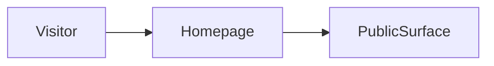

# Build map: noaerth

Derived from the repository. Not a guessed architecture.

## Canonical entrypoint
`app/page.tsx`

Next prefers ./app over ./src/app.

## Dead or superseded paths
- none detected

These are not deleted. They are marked so the next pass does not treat them as the product.

## Homepage evidence
`app/page.tsx`

## Routes
- `app/about/page.tsx`
- `app/autobuilder/page.tsx`
- `app/contact/page.tsx`
- `app/dashboard/page.tsx`
- `app/demo/page.tsx`
- `app/docs/page.tsx`
- `app/examples/page.tsx`
- `app/faq/page.tsx`
- `app/founder/page.tsx`
- `app/how-it-works/page.tsx`
- `app/intake/page.tsx`
- `app/investor/page.tsx`
- `app/investors/page.tsx`
- `app/labs/page.tsx`
- `app/page.tsx`
- `app/portfolio/page.tsx`
- `app/pricing/page.tsx`
- `app/privacy/page.tsx`
- `app/product/page.tsx`
- `app/report/page.tsx`
- `app/support/page.tsx`
- `app/team/page.tsx`
- `app/terms/page.tsx`
- `app/trust/page.tsx`
- `app/updates/page.tsx`
- `app/use-cases/page.tsx`
- `app/workspace/page.tsx`

## Commands
- `dev`: `next dev`
- `build`: `next build`
- `start`: `next start`
- `lint`: `eslint`
- `typecheck`: `tsc --noEmit`

## Direct dependencies
@supabase/supabase-js, next, react, react-dom

