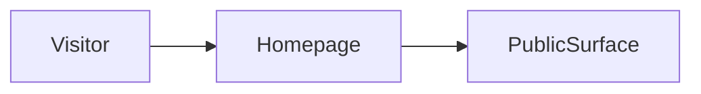

# Build map: portfolio-control

Derived from the repository. Not a guessed architecture.

## Canonical entrypoint
`portfolio_os/cli.py`

Python control plane. There is no Next homepage.

## Dead or superseded paths
- none detected

These are not deleted. They are marked so the next pass does not treat them as the product.

## Homepage evidence
`none`

## Routes
- none found

## Commands
- no package scripts

## Direct dependencies
none recorded

